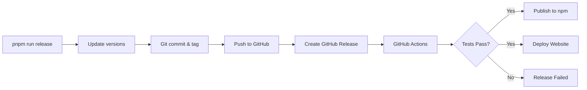

# Quick Release Guide

## TL;DR

```bash
# Create a new release (interactive)
pnpm run release

# CI automatically:
# ✅ Tests everything
# 📦 Publishes to npm (@beta or @latest)
# 🌐 Deploys website to GitHub Pages
```

## Release Types

| Command | Version Change | npm Tag | Use Case |
|---------|---------------|---------|----------|
| `pnpm run release` → Option 1 | 1.0.0-beta.1 → 1.0.0-beta.2 | `@beta` | Bug fixes in beta |
| `pnpm run release` → Option 2 | 1.0.0-beta.1 → 1.1.0-beta.1 | `@beta` | New features in beta |
| `pnpm run release` → Option 3 | 1.0.0-beta.1 → 2.0.0-beta.1 | `@beta` | Breaking changes |
| `pnpm run release` → Option 4 | 1.0.0-beta.1 → 1.0.0 | `@latest` | Stable release |
| `pnpm run release` → Option 5 | Custom | Auto-detect | Custom version |

## Users Install With

```bash
# Latest stable (production)
npm install @coherent.js/core

# Latest beta (testing)
npm install @coherent.js/core@beta

# Specific version
npm install @coherent.js/core@1.0.0-beta.2
```

## Before Each Release

```bash
# 1. Ensure everything works
pnpm install
pnpm lint
pnpm test
pnpm build

# 2. Commit all changes
git add .
git commit -m "fix: your changes"
git push

# 3. Run release
pnpm run release
```

## What Happens



## Troubleshooting

| Problem | Solution |
|---------|----------|
| Script fails | Install GitHub CLI: `brew install gh` or `apt install gh` |
| Not logged in | Run: `gh auth login` |
| Tag exists | Delete: `git tag -d v1.0.0 && git push origin :v1.0.0` |
| CI fails | Check [GitHub Actions](https://github.com/Tomdrouv1/coherent.js/actions) |
| npm publish fails | Check `NPM_TOKEN` secret in GitHub |

## Full Documentation

See [docs/RELEASE_PROCESS.md](docs/RELEASE_PROCESS.md) for complete details.
